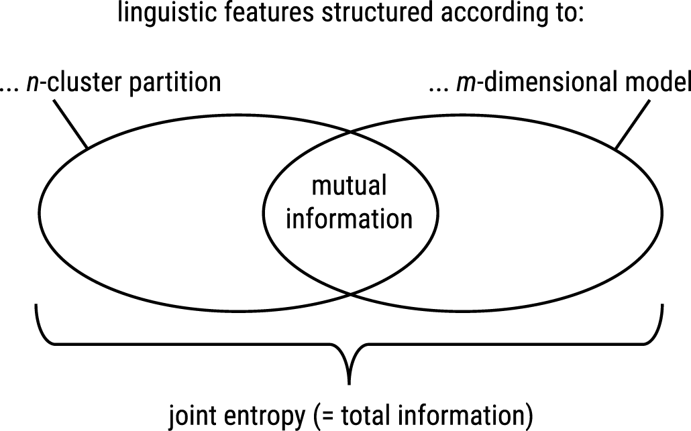

```{r include=FALSE}
library(tidyverse)
```

**NB:** This is complementary material to Section 4 of XX (YYYY), which
presents a more accessible conceptual background to the rather technical
discussion below.

Introduction
============

In *multi-dimensional analysis* (MDA; Biber 1988), linguistic features
are grouped into dimensions of variation based on the texts in which
they co-occur, via a statistical procedure called *factor analysis*
(FA). One input parameter to FA is the **number of factors to extract**,
which are then interpreted as dimensions. Consequently, this parameter
has a considerable influence on the picture of language variation that
emerges from the analysis.

Many heuristic methods designed to help with making that choice exist,
all of them with advantages and disadvantages (Revelle 2017: 38). One
popular choice in the context of MDA is to manually compare several
plausible candidate models (with different numbers of factors) and
select the one which yields the best interpretation. The procedure
presented here is an attempt to quantify some of the criteria used in
model comparison, so as to aid decision in situations where no clear
winner emerges based on manual comparisons.

The procedure can be summarized thus:

1. Perform hierarchical cluster analysis on the features based on their
   *absolute* loadings on all factors of all candidate models. This
   gives us an idea of which regularities tend to hold across all
   proposed solutions: e.g. features $A$ and $B$ may tend to always load
   heavily on the same dimension, so they emerge from the HCA as close
   to one another, whereas $C$ always loads most prominently elsewhere.
2. For each $f$-factor model, generate a corresponding $f$-cluster
   partition of the HCA output (by pruning it).
3. Take every possible pair of $i$-factor model and $j$-cluster
   partition and compare how they structure the features into factors /
   clusters. Is the mapping straightforward (tidy) or messy (tangled)?
   Quantify that using a measure, call it *tidiness* (see more below).
4. Use the performance of the individual candidate models across the
   comparisons in 3 to inform your choice of which one to stick with: a
   model which tends to come out of these comparisons as tidier than its
   peers is one that better represents the robust feature-grouping
   trends inferred via HCA, which is an argument in its favor.
   
This document focuses on step 3: how to operationalize *tidiness*. We
start by giving an abstract definition, but if it feels dense, you may
want to skip ahead to the [concrete example with code](#implementation)

Defining *tidiness*
===================

<center>
{ width=60% }
</center>

*Tidiness* is based on information-theoretic measures: the [*mutual
information*](https://en.wikipedia.org/wiki/Mutual_information) of a
random variable ($I(X; Y)$) and the [*joint
entropy*](https://en.wikipedia.org/wiki/Joint_entropy) of two random
variables ($H(X, Y)$). It quantifies how much information about one
grouping (e.g. factors) can be inferred from knowing the other grouping
(e.g. clusters), relative to how much information the entire system
consisting of both groupings contains:

$$
tidiness(X, Y) = \frac{I(X; Y)}{H(X,Y)}
$$

where, as per the definitions of mutual information and joint entropy:

$$
\begin{align*}
I(X; Y) &= \sum_{y \in Y}\sum_{x \in X} p(x, y) \log_2 \left( \frac{p(x,y)}{p(x) p(y)} \right) \\
H(X, Y) &= - \sum_{y \in Y}\sum_{x \in X} p(x, y) \log_2 \left[ p(x,y) \right] \\
\end{align*}
$$

Furthermore, $p(x,y)$ is the [joint
probability](https://en.wikipedia.org/wiki/Joint_probability_distribution)
function of $X$ and $Y$; $p(x)$ and $p(y)$ are the [marginal probability
distribution](https://en.wikipedia.org/wiki/Marginal_distribution)
functions of $X$ and $Y$ respectively. Finally, $X$ is an $i$-cluster
partition and $Y$ is a $j$-factor model.

Implementation
==============

Example data
------------

The objective is to compare two groupings (clusters and factors) of the
same objects (features), assessing how tidy the mapping from one to the
other is.

In one of the groupings (clusters), group membership is binary and
exclusive: a feature either belongs to a cluster or not. Say we have 4
features and 2 clusters. We can generate a table that tells us, for
every possible combination of feature and cluster, whether that feature
belongs to the cluster or not:

```{r}
clusters <- expand.grid(FEATURE=LETTERS[1:4], CLUSTER=c("c1", "c2")) %>% as_tibble()
clusters$BELONGS_TO_CLUSTER <- c(1, 1, 0, 0, 0, 0, 1, 1)
clusters
```

$\Rightarrow$ Features `A` and `B` belong to cluster `c1`, `C` and `D` to `c2`.

In the other grouping (factors), group membership is gradual, each
feature can belong to different factors to different extents, as
quantified by its different loadings on those factors. Again, here's a
possible table for 4 features and 2 factors (it could have been a
different number, in general, we want to be able to compare any
$i$-cluster partition with any $j$-factor model; only the number of
features remains the same):

```{r}
factors <- expand.grid(FEATURE=LETTERS[1:4], FACTOR=c("f1", "f2")) %>% as_tibble()
factors$LOADING_ON_FACTOR <- c(.1, .05, .6, -.7, -.5, .55, -.02, .2)
factors
```

$\Rightarrow$ Features `A` and `B` have a tendency to load more heavily
on (= belong "more" to) factor `f2`, `C` and `D` to `f1`.

We can now merge the information about both groupings into a single
table:

```{r}
data <- inner_join(clusters, factors, by="FEATURE")
data
```

The observed occurrences of features within clusters are tallied in the
`BELONGS_TO_CLUSTER` column, the correlations between features and
factors are indicated in the `LOADING_ON_FACTOR` column. Each row
represents an event where a given feature was found in a given cluster
and a given factor at the same time.

To compute the weight of that event (its unnormalized probability),
multiply `BELONGS_TO_CLUSTER` by the **absolute value** of
`LOADING_ON_FACTOR`. The absolute value is used because we only care
about the **strength** of the correlation between a factor and a
feature, not its **direction**.

```{r}
weighted <- mutate(data, WEIGHT=BELONGS_TO_CLUSTER * abs(LOADING_ON_FACTOR)) %>%
  select(-BELONGS_TO_CLUSTER, -LOADING_ON_FACTOR)
weighted
```

As expected, only rows where the features are with the cluster where
they actually occurred contribute a non-zero `WEIGHT` value. We can
therefore clean up the table to make it smaller:

```{r}
non_zero <- filter(weighted, WEIGHT > 0)
non_zero
```

If later on, you find yourself wondering, "But what happened e.g. to the
events where feature `A` is seen in cluster `c2`, shouldn't these
contribute to the calculation as well?", well they do in theory, but
their contribution is defined as 0, because `A` belongs to `c1`, not
`c2`, so the weight of these events is 0 and we can afford to discard
them early.

From weights to probabilities
-----------------------------

We're now interested in the mapping between clusters and factors: does
the group of features in `c1` map more or less straightforwardly onto
the features that load heavily on `f1`, or `f2` (= tidy), or conversely,
is it maybe split between the two (= tangled)? In the tangled case, it's
harder to predict, given that a feature belongs to cluster `c1`, whether
it will load more heavily on factor `f1` or `f2`.

In order to assess this, we can aggregate the weights for every
combination of `CLUSTER` and `FACTOR`:

```{r}
aggregated <- select(non_zero, -FEATURE) %>%
  group_by(CLUSTER, FACTOR) %>%
  summarize(WEIGHT=sum(WEIGHT)) %>%
  ungroup()
aggregated
```

$\Rightarrow$ The correspondence between `c1` and `f1` is weak, so it
doesn't compete very much with the strong correspondence between `c1`
and `f2`.

We can re-arrange this in more compact form as a `CLUSTER` × `FACTOR`
table...

```{r}
rearranged <- spread(aggregated, FACTOR, WEIGHT) %>%
  as.data.frame() %>%
  remove_rownames() %>%
  column_to_rownames("CLUSTER") %>%
  as.matrix()
rearranged
```

... and normalize the weights to yield probabilities, pre-computing the
joint and marginal probability distributions:

```{r}
joint <- prop.table(rearranged)
joint
```

```{r}
marginal_rows <- margin.table(joint, 1)
marginal_rows
```

```{r}
marginal_columns <- margin.table(joint, 2)
marginal_columns
```

Computing mutual information, joint entropy and *tidiness*
----------------------------------------------------------

We now have all we need to fill out the equations given
[above](#defining-tidiness). First, mutual information ($I$):

```{r}
# the comments refer back to the equation above
I <- 0
# outer Σ: for cluster x in i-cluster partition X
for (rn in rownames(joint)) {
  # inner Σ: for factor y in j-factor model Y
  for (cn in colnames(joint)) {
    # joint probability of cluster x and factor y
    j <- joint[rn, cn]
    # marginal probability of cluster x
    mr <- marginal_rows[rn]
    # marginal probability of factor y
    mc <- marginal_columns[cn]
    I <- I + j * log2(j / (mr * mc))
  }
}
I <- unname(I)
I
```

Now, joint entropy ($H$):

```{r}
H <- 0
for (j in joint) {
  H <- H - j * log2(j)
}
H
```

And finally, *tidiness*:

```{r}
TIDINESS <- I / H
TIDINESS
```

Of course, one tidiness number on its own isn't all that useful, we want
to use it to *compare* models. We'll try some examples
[below](#testing-if-it-works), after we've defined appropriate functions
to encapsulate the calculations sketched above.

Wrapping all of this in functions
---------------------------------

Our `tidiness()` function will accept a data frame in the format of the
`data` data frame prepared above:

```{r}
data
```

The calculations in the previous sections were implemented using
for-loops in order to more closely match the equations given previously.
In the functions, we'll use a vectorized implementation instead.

```{r}
tidiness <- function(data) {
  data_with_probabilities <- weight_and_aggregate(data) %>%
    add_probabilities()
  I <- mutual_information(data_with_probabilities) 
  H <- joint_entropy(data_with_probabilities)
  I / H
}

weight_and_aggregate <- function(data) {
 mutate( 
    data,
    # compute weights
    WEIGHT=BELONGS_TO_CLUSTER * abs(LOADING_ON_FACTOR)
  ) %>%
    # drop rows with WEIGHT = 0
    filter(WEIGHT > 0) %>%
    # drop unnecessary information
    select(-FEATURE, -BELONGS_TO_CLUSTER, -LOADING_ON_FACTOR) %>%
    # aggregate weights by cluster and factor
    group_by(CLUSTER, FACTOR) %>%
    summarize(WEIGHT=sum(WEIGHT)) %>%
    ungroup()
}

add_probabilities <- function(weighted_and_aggregated_data) {
  # compute joint prob. dist.
  mutate(weighted_and_aggregated_data, JOINT=WEIGHT / sum(WEIGHT)) %>%
    # compute marginal prob. dist. (clusters)
    group_by(CLUSTER) %>%
    mutate(MARGINAL_CLUSTER=sum(JOINT)) %>%
    ungroup() %>%
    # compute marginal prob. dist. (factors)
    group_by(FACTOR) %>%
    mutate(MARGINAL_FACTOR=sum(JOINT)) %>%
    ungroup()
}

mutual_information <- function(data_with_probabilities) {
  with(
    data_with_probabilities,
    sum(JOINT * log2(JOINT / (MARGINAL_CLUSTER * MARGINAL_FACTOR)))
  )
}

joint_entropy <- function(data_with_probabilities) {
  with(
    data_with_probabilities,
    -1 * sum(JOINT * log2(JOINT))
  )
}
```

Let's double check that we get the same results as previously. For
reference, here's the value we calculated manually above:

```{r}
TIDINESS
```

And here's the result of our function:

```{r}
tidiness(data)
```

Looks like we're good to go!

Testing if it works
===================

In order to see if *tidiness* does the job we expect it to do, we need
to compare its output on different data. The data we've worked with so
far is fairly tidy, `c1` is strongly associated with `f2`, `c2` with
`f1`, and the remaining associations are much weaker:

```{r}
aggregated
```

Let's make it messier. The only difference will be that now, feature `B`
will load comparably on both factors `f1` and `f2`:

```{r}
messier_data <- mutate(
  data,
  LOADING_ON_FACTOR=ifelse(FEATURE == "B" & FACTOR == "f1", .60, LOADING_ON_FACTOR)
)
messier_data
```

This is what `messier_data` looks like when weighted and aggregated:

```{r}
weight_and_aggregate(messier_data)
```

As you can see, the correspondence between `c1` and `f1` has become a
more serious competitor (its weight rose from 0.15 to 0.70) to the
correspondence between `c1` and `f2` (weight = 1.05). Let's see how
*tidiness* responds to that:

```{r}
# same as above, for easier comparison
tidiness(data)
```

```{r}
tidiness(messier_data)
```

```{r}
tidiness(data) > tidiness(messier_data)
```

Good, it seems to work! The data we made messier on purpose is indeed
identified as less tidy than the original data. This makes sense,
because in `messier_data`, the structure of factors has become less
predictable based on the structure of clusters.

References
==========

XX. YYYY. *From extra- to intratextual characteristics: Charting the
  space of variation in Czech through MDA*.

Revelle, William. 2017. *psych: Procedures for Personality and
  Psychological Research*. Northwestern University, Evanston, Illinois,
  USA. <https://CRAN.R-project.org/package=psych> Version = 1.7.8.

Biber, Douglas. 1988. *Variation across speech and writing*.
  Cambridge: Cambridge University Press.
